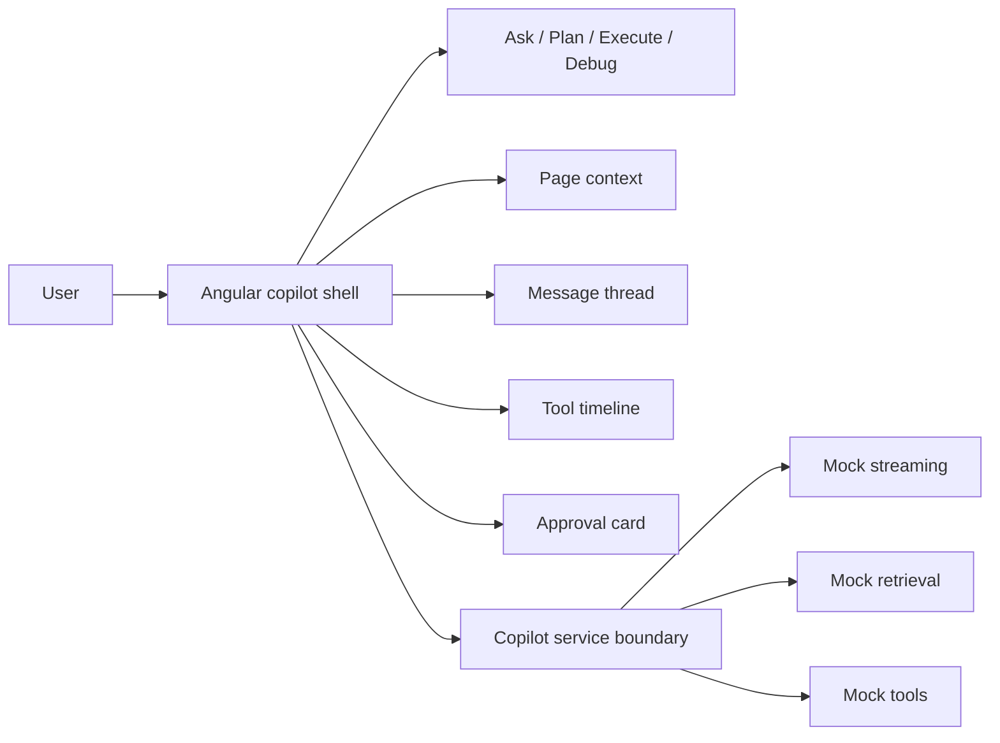

# Architecture Review — Angular AI Copilot Starter

This repository is the **small, immediately runnable AI frontend proof** in the portfolio. It intentionally uses deterministic/mock services so reviewers can inspect Angular architecture and interaction state without API keys or hidden backend claims.

## System context



## Interaction state

```text
idle
 -> thinking
 -> retrieving
 -> planning
 -> awaiting approval
 -> executing
 -> completed

failure path:
 -> failed
 -> recovering
 -> retry / terminal
```

## Why the mock boundary is architectural proof

The repository is not trying to prove a production model backend. It proves that the Angular application is prepared to consume a production-shaped contract:

- state is typed instead of inferred from one `loading` flag
- citations are separate from assistant prose
- tool execution is visible
- approvals are explicit
- context is modeled as structured data
- failure/recovery can be represented without rebuilding the shell

A real integration should replace service adapters, not rewrite the product interaction model.

## Production trust boundary

If this starter is connected to real providers, the production architecture should be:

```text
Angular starter
   |
   | public config + typed requests/events
   v
Backend / gateway
   - provider secrets
   - authentication
   - retrieval access
   - tool policy
   - durable approval state
   v
Models / data / tools
```

Do not move provider keys or protected tool execution into the browser.

## Failure scenarios the demo should prove

- stalled stream → retryable UI
- retrieval unavailable → no fabricated source cards
- tool failure → visible failed timeline item
- approval rejection → execution never appears successful
- recovery → previous user context remains understandable

## Architect review checklist

- [ ] Angular components depend on typed models/service boundaries, not provider SDK payloads.
- [ ] AI states are accessible and visually distinct.
- [ ] Tool and citation data are inspectable.
- [ ] Mock behavior is labelled honestly.
- [ ] Connecting a real backend would preserve the UI contract.

## Portfolio role

Use this repo for the fastest visual review. For the full backend/security/platform architecture, continue to [`ngx-copilot-platform`](https://github.com/AnkitParekh007/ngx-copilot-platform). For reusable interaction contracts, see [`frontend-ai-patterns`](https://github.com/AnkitParekh007/frontend-ai-patterns).
