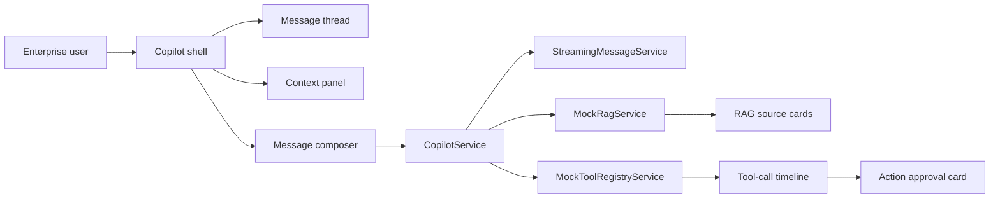

# Angular AI Copilot Starter


Build a production-style Angular AI copilot UI with streaming chat, RAG source cards, MCP/tool-call timeline, action approvals, and enterprise agent modes.


**Live demo:** `[add deployed demo URL]`
**Topics:** `angular` `typescript` `ai-copilot` `rag` `mcp` `llm` `ai-agents` `tool-calling` `streaming-ui` `frontend-architecture` `enterprise-ui` `agent-ui` `copilot-ui` `rxjs` `guardrails`

## Preview

This is a mock-only Angular demo that shows the frontend architecture of an enterprise AI copilot:

- left session sidebar
- central streaming conversation thread
- bottom prompt composer
- right context, RAG, tool, and approval panel
- agent modes for Ask, Plan, Execute, and Debug
- light/dark theme toggle
- responsive layout

## Why This Exists

Most AI chat demos stop at a text box. Enterprise copilots need more visible structure: page context, grounded sources, tool execution status, human approval, recovery states, and clear UI boundaries between frontend and backend responsibilities.

This repo demonstrates those AI frontend patterns in Angular without using real model providers, paid APIs, secrets, or private data.

## Why Star This Repo?

- Learn how to structure AI copilot UI in Angular
- See patterns for RAG citations, tool calling, and approval flows
- Reuse enterprise-ready TypeScript models
- Use it as a starter for internal AI assistants
- Study Angular-first AI frontend architecture beyond simple chat UI

## Who This Helps

- Frontend engineers moving into AI product engineering
- Angular teams building copilots
- AI startups needing enterprise UI patterns
- Product teams adding RAG and tool calling to web apps
- Recruiters evaluating AI frontend architecture depth
- Maintainers looking for Angular examples or UI adapters

## Features

- Modern three-panel Angular copilot shell
- Mock streaming response simulation
- RAG source cards with confidence and source types
- MCP-style tool-call timeline
- Human approval card for risky workflow actions
- Execution status pills for thinking, retrieving context, planning, awaiting approval, executing, completed, failed, and recovering
- Agent modes: Ask, Plan, Execute, Debug
- Page context panel with route, selected record, role, tenant, and visible fields
- Light/dark theme toggle
- Responsive layout for smaller screens
- Mock-only services, no API keys required

## Demo Walkthrough

1. Run the app with `npm start`.
2. Open the copilot shell.
3. Switch between Ask, Plan, Execute, and Debug.
4. Click **Run Demo Flow**.
5. Watch the assistant message stream token-by-token.
6. Inspect RAG source cards after retrieval.
7. Review the MCP/tool timeline after planning.
8. Approve or reject the mock workflow action.
9. Discuss how the mock services would map to a real backend.

## Architecture



## Tech Stack

- Angular 20
- TypeScript
- RxJS
- Standalone components
- Angular signals
- Mock RAG/tool services
- Mermaid documentation

## Folder Structure

```text
src/app/
  app.component.ts
  copilot/
    components/
      action-approval-card/
      agent-mode-selector/
      context-panel/
      copilot-shell/
      execution-status-pill/
      message-composer/
      message-thread/
      rag-source-card/
      session-sidebar/
      theme-toggle/
      tool-call-timeline/
    mocks/
    models/
    services/
docs/
  assets/screenshots/
  architecture.md
  demo-script.md
  deployment.md
WHAT_THIS_PROVES.md
RECRUITER_REVIEW_GUIDE.md
```

## Core Concepts

| Concept | What it shows |
| --- | --- |
| Streaming UX | Token-by-token mock response with visible execution state |
| RAG UI | Source cards with snippets, source type, and confidence |
| Tool timeline | MCP-style tool planning and execution visibility |
| Action approval | Human-in-the-loop UX before workflow-changing actions |
| Agent modes | Different UX expectations for ask, plan, execute, and debug |
| Context panel | Safe page context shown before agent action |
| Enterprise guardrails | Mock-only boundaries, no secrets, visible approvals |

## How To Run

```bash
npm install
npm start
```

Open the local Angular URL shown by the CLI.

Build check:

```bash
npm run build
```

## Screenshots

Placeholder screenshots are included until real screenshots are captured from the running app.

| State | Screenshot |
| --- | --- |
| Copilot shell light | `docs/assets/screenshots/copilot-shell-light.png` |
| Copilot shell dark | `docs/assets/screenshots/copilot-shell-dark.png` |
| Streaming message | `docs/assets/screenshots/streaming-message.png` |
| RAG source cards | `docs/assets/screenshots/rag-source-cards.png` |
| Tool-call timeline | `docs/assets/screenshots/tool-call-timeline.png` |
| Action approval flow | `docs/assets/screenshots/action-approval-flow.png` |
| Agent mode selector | `docs/assets/screenshots/agent-mode-selector.png` |
| Responsive mobile | `docs/assets/screenshots/responsive-mobile.png` |

See [SCREENSHOT_CAPTURE_GUIDE.md](SCREENSHOT_CAPTURE_GUIDE.md).

## What This Proves

This repo demonstrates:

- Angular component architecture for AI copilots
- Streaming UX patterns
- RAG source rendering
- MCP/tool-call timeline design
- Human approval UX
- Agent mode modeling
- Enterprise-safe AI workflow thinking
- Clean TypeScript interfaces for AI frontend systems

## Recruiter Review Guide

For a 30-second review:

1. Look at the preview image.
2. Read the one-line pitch.
3. Scan Features and What This Proves.

For a 2-minute technical review:

1. Inspect `src/app/copilot/models/`.
2. Inspect `src/app/copilot/services/`.
3. Inspect `src/app/app.component.ts`.
4. Review `WHAT_THIS_PROVES.md`.
5. Review `RECRUITER_REVIEW_GUIDE.md`.

## Contribution Guide

Contributions are welcome around screenshots, responsive layout, accessibility, mock tools, RAG source rendering, tests, docs, and UI variants.

See [CONTRIBUTING.md](CONTRIBUTING.md).

## Good First Issues

- Add screenshot/GIF to README
- Add dark/light theme screenshot
- Add mobile responsive layout improvements
- Add another mock MCP tool
- Improve RAG source card accessibility
- Add unit tests for streaming service
- Add error recovery demo state
- Add keyboard navigation
- Add Angular Material variant
- Add PrimeNG variant
- Add Storybook component previews
- Add animated tool timeline

See [GOOD_FIRST_ISSUES.md](GOOD_FIRST_ISSUES.md).

## Roadmap

See [ROADMAP.md](ROADMAP.md).

## Live Demo Deployment

See [DEPLOYMENT_GUIDE.md](DEPLOYMENT_GUIDE.md) and [LIVE_DEMO_CHECKLIST.md](LIVE_DEMO_CHECKLIST.md).

## What Is Mocked vs Real

Mocked:

- LLM responses
- RAG retrieval
- MCP/tool execution
- approvals
- sessions

Real:

- Angular component structure
- TypeScript models
- UI architecture
- simulated streaming UX
- reusable frontend patterns
- documentation and contribution structure

This is not claimed as production-ready. It is a public proof project and starter architecture.

## Author

Ankit Parekh

- GitHub: [github.com/AnkitParekh007](https://github.com/AnkitParekh007)
- Portfolio: [ankitparekh007.github.io/resume](https://ankitparekh007.github.io/resume/)

## Follow Along

I am building Angular-first AI frontend patterns for copilots, RAG UX, MCP/tool calling, UI-aware agents, and enterprise AI interfaces.

Star or watch this repo if you want updates.
