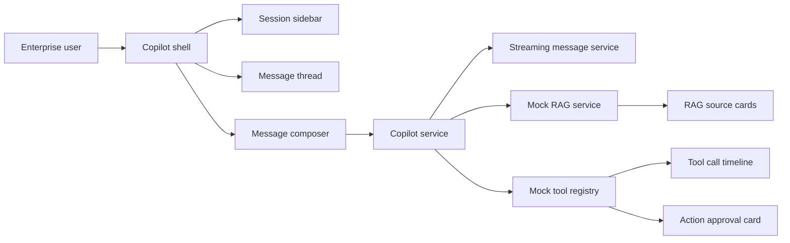

# Angular AI Copilot Starter

Angular AI copilot starter with streaming chat UX, RAG source cards, tool-call timeline, action approvals, mock MCP tools, and enterprise agent modes.

## What This Project Demonstrates

This public proof project shows how an enterprise Angular application can embed a serious AI copilot experience without exposing real LLM keys or private workflows. It focuses on UI architecture, typed state models, mocked backend contracts, and recruiter-friendly documentation.

## Screenshots

See `docs/screenshots.md` for screenshot placeholders and capture guidance.

## Features

- Codex-style copilot layout.
- Collapsible session sidebar.
- Agent modes: Ask, Plan, Execute, Debug.
- Streaming response UX.
- RAG source cards.
- Tool-call timeline.
- Action approval cards.
- Mock MCP tools.
- Execution status states: idle, thinking, retrieving_context, planning, awaiting_approval, executing_tool, completed, failed, recovering.
- Enterprise-safe UX patterns with approval gates and visible audit-friendly state.

## Architecture



## Tech Stack

- Angular
- TypeScript
- RxJS
- Mock services instead of real LLM providers
- Mermaid architecture docs

## Folder Structure

```text
src/app/copilot/
  components/
  services/
  models/
  mocks/
docs/
```

## How To Run

```bash
npm install
npm start
```

This repo currently uses mock data only. No API key is required.

## Demo Script

See `docs/demo-script.md`.

## Recruiter Value

This repo proves that Ankit can reason about AI-native Angular UI architecture: streaming state, RAG evidence, tool execution visibility, approval controls, and enterprise-safe interaction design.

## Roadmap

- Add polished Angular screens for each component.
- Add screenshot assets.
- Add unit tests for stream and state transitions.
- Add a backend proxy example without committing secrets.

## Author

Ankit Parekh - AI Frontend Architect building enterprise Angular and TypeScript applications with embedded AI copilots and agentic workflows.
