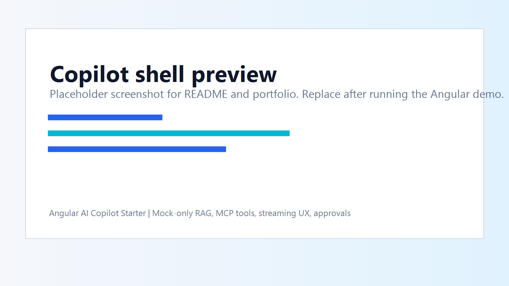

# Angular AI Copilot Starter

   

Angular AI copilot starter with streaming chat UX, RAG source cards, tool-call timeline, action approvals, mock MCP tools, and enterprise agent modes.



**Live demo:** [add deployed demo URL]

## What This Is

A recruiter-friendly Angular proof project showing how an enterprise application can embed a serious AI copilot UI without exposing real model keys or private data. The app uses mock services and typed state models to demonstrate the frontend architecture.

## Why It Matters

Enterprise copilots need more than a chat box. They need visible context, grounded sources, tool execution status, approval gates, and recovery states that users can trust.

## Features

- Three-panel copilot shell with session sidebar, message thread, and context/tool panel.
- Agent modes: Ask, Plan, Execute, Debug.
- Mock streaming response surface.
- RAG source cards with source type, snippet, and confidence.
- Tool-call timeline for MCP-style actions.
- Action approval card for workflow-changing operations.
- Execution status pills for thinking, retrieving context, planning, awaiting approval, executing, completed, failed, and recovering.
- Mock-only services. No API keys required.

## Architecture

```mermaid
flowchart LR
    User["Enterprise user"] --> Shell["Copilot shell"]
    Shell --> Sessions["Session sidebar"]
    Shell --> Thread["Message thread"]
    Shell --> Context["Context and tool panel"]
    Thread --> Composer["Message composer"]
    Composer --> CopilotService["CopilotService"]
    CopilotService --> Streaming["StreamingMessageService"]
    CopilotService --> RAG["MockRagService"]
    CopilotService --> Tools["MockToolRegistryService"]
    RAG --> SourceCards["RAG source cards"]
    Tools --> Timeline["Tool-call timeline"]
    Timeline --> Approval["Action approval card"]
```

## Tech Stack

- Angular 20
- TypeScript strict mode
- RxJS
- Standalone components
- Mock RAG/tool services
- Mermaid documentation

## Folder Structure

```text
src/app/
  app.component.ts
  copilot/
    components/
    models/
    mocks/
    services/
docs/
  assets/screenshots/
  architecture.md
  demo-script.md
  deployment.md
  interview-talking-points.md
  recruiter-notes.md
WHAT_THIS_PROVES.md
```

## How To Run

```bash
npm install
npm start
```

Build check:

```bash
npm run build
```

## Demo Walkthrough

1. Open the shell and scan the session sidebar.
2. Switch between Ask, Plan, Execute, and Debug modes.
3. Review the mock streaming assistant response.
4. Inspect RAG source cards for grounding evidence.
5. Review the tool-call timeline and approval card.
6. Discuss how this maps to backend-governed MCP tools in production.

## Recruiter Value

This repo proves Angular AI frontend architecture: composable UI zones, typed models, visible agent state, RAG evidence, tool execution UX, and enterprise approval flows.

## Interview Talking Points

- Why enterprise copilots need visible tool execution and approval gates.
- How RxJS can support streaming response UI.
- Why RAG sources should be rendered as inspectable evidence.
- How agent modes change UX and safety expectations.
- Why provider secrets and real tools belong behind backend APIs.

## Deployment

See [docs/deployment.md](docs/deployment.md) for GitHub Pages, Vercel, and Netlify options.

## Roadmap

- Capture real screenshots and replace placeholders.
- Add component-level tests for status and approval states.
- Add optional backend proxy example with no committed secrets.
- Add GitHub Pages deployment workflow after demo URL is confirmed.

## Author

Ankit Parekh

- GitHub: https://github.com/AnkitParekh007
- Portfolio: https://ankitparekh007.github.io/resume/

## Who This Helps

- Frontend engineers moving into AI product engineering
- Angular teams building copilots
- AI startups needing enterprise UI patterns
- Product teams adding RAG and tool calling to web apps
- Recruiters evaluating AI frontend architecture depth

## Contributing

Contributions are welcome around:

- Angular component improvements
- accessibility
- documentation
- mock data examples
- UI states
- RAG source rendering
- MCP/tool-call examples
- testing
- demo deployment

See [CONTRIBUTING.md](CONTRIBUTING.md) and [GOOD_FIRST_ISSUES.md](GOOD_FIRST_ISSUES.md).

## Good First Issues

- Add a screenshot/GIF to the README
- Improve responsive layout
- Add more mock RAG sources
- Add another tool-call example
- Add accessibility labels
- Add unit tests for models/services
- Improve README diagrams

## Follow For More Angular AI Frontend Patterns

This repo is part of a public AI frontend architecture series focused on Angular copilots, RAG UX, MCP/tool-calling interfaces, UI-aware agents, approvals, and enterprise guardrails.
