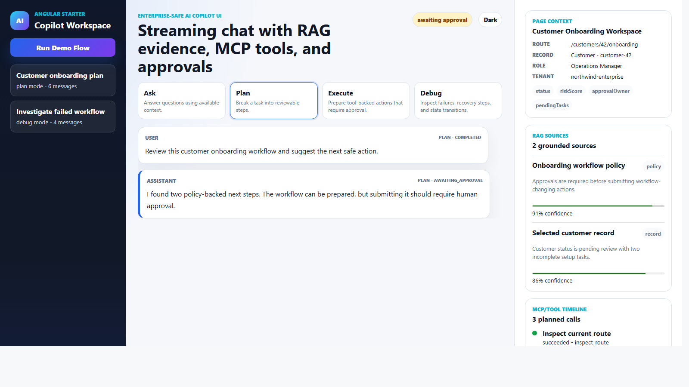
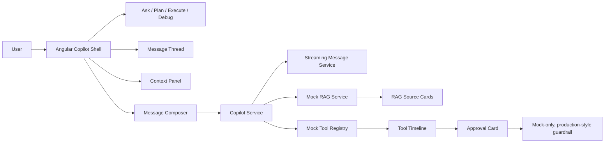

# Angular AI Copilot Starter


Build a polished, recruiter-facing Angular AI copilot demo with streaming chat UX, RAG source cards, MCP-style tool timeline, action approvals, mock MCP tools, and enterprise agent modes.



**Deploy path:** GitHub Pages workflow included. After enabling Pages, publish to:
`https://ankitparekh007.github.io/angular-ai-copilot-starter/`

**Live demo CTA:** this repo is mock-only but production-style. No API keys, no backend claims, no hidden services.

## Why this repo matters

Most Angular AI demos stop at a chat box. This repo shows the rest of the product workflow:

- visible context
- streaming response states
- grounded RAG evidence
- tool planning and execution visibility
- human approval before risky actions
- mode-specific behavior for Ask, Plan, Execute, and Debug

## 20-second GIF section

Recommended walkthrough beats for a README GIF:

1. Start in Ask mode.
2. Switch to Plan mode.
3. Run the demo flow.
4. Show streaming response in the message thread.
5. Highlight RAG source cards.
6. Highlight the tool timeline.
7. Pause on the approval card.
8. Toggle dark mode.

Suggested future asset:

`docs/assets/screenshots/demo-walkthrough.gif`

## What this proves

This project demonstrates:

- Angular-first AI frontend architecture
- typed UI boundaries for copilot systems
- streaming UX without pretending a real model backend exists
- grounded answer presentation with source cards
- MCP-style tool planning and execution visibility
- human approval UX before risky actions
- responsive, theme-aware enterprise copilot layout
- honest mock-only boundaries suitable for recruiter review

## Demo walkthrough

1. Run `npm install`
2. Run `npm start`
3. Open the local Angular URL
4. Switch between Ask, Plan, Execute, and Debug
5. Click **Run Demo Flow**
6. Watch the assistant response stream into the thread
7. Inspect the RAG source cards
8. Inspect the tool timeline
9. Approve or reject the mock workflow action
10. Discuss how the mock services would map to a real backend contract

## Architecture diagram



## Recruiter review in 3 minutes

### Minute 1

- scan the hero screenshot
- read the one-line pitch
- read **What this proves**

### Minute 2

- inspect the Ask / Plan / Execute screenshots
- review the architecture diagram
- confirm the mock-only boundaries are explicit

### Minute 3

- inspect `src/app/copilot/models/`
- inspect `src/app/copilot/services/`
- inspect `src/app/copilot/components/`

More detail:

- [RECRUITER_REVIEW_GUIDE.md](RECRUITER_REVIEW_GUIDE.md)
- [WHAT_THIS_PROVES.md](WHAT_THIS_PROVES.md)
- [docs/recruiter-notes.md](docs/recruiter-notes.md)

## Features

- modern three-panel Angular copilot shell
- reusable standalone components for key copilot surfaces
- mock streaming response simulation
- RAG source cards with confidence and source types
- MCP-style tool-call timeline
- human approval card for risky workflow actions
- execution status pill for thinking, retrieving, planning, awaiting approval, executing, completed, failed, and recovering
- agent modes: Ask, Plan, Execute, Debug
- page context panel with route, selected record, role, tenant, and visible fields
- light/dark theme toggle
- responsive layout for smaller screens
- mock-only services, no API keys required

## Screenshots

The screenshot set is organized around the states this repo is meant to prove:

| State | Path |
| --- | --- |
| Light shell | `docs/assets/screenshots/copilot-shell-light.png` |
| Dark shell | `docs/assets/screenshots/copilot-shell-dark.png` |
| Ask / streaming | `docs/assets/screenshots/streaming-message.png` |
| Plan / RAG sources | `docs/assets/screenshots/rag-source-cards.png` |
| Execute / tool timeline | `docs/assets/screenshots/tool-call-timeline.png` |
| Approval card | `docs/assets/screenshots/action-approval-flow.png` |
| Responsive mobile | `docs/assets/screenshots/responsive-mobile.png` |

See:

- [SCREENSHOT_CAPTURE_GUIDE.md](SCREENSHOT_CAPTURE_GUIDE.md)
- [SCREENSHOT_STATUS.md](SCREENSHOT_STATUS.md)

## How to run

```bash
npm install
npm start
```

Build:

```bash
npm run build
```

Tests:

```bash
npm test
```

## Live demo deployment

This repo does not claim a live URL yet, but it now includes a real deployment workflow and checklist:

- [.github/workflows/deploy-pages.yml](.github/workflows/deploy-pages.yml)
- [DEPLOYMENT_GUIDE.md](DEPLOYMENT_GUIDE.md)
- [LIVE_DEMO_CHECKLIST.md](LIVE_DEMO_CHECKLIST.md)
- [LIVE_DEMO_STATUS.md](LIVE_DEMO_STATUS.md)

Target URL after Pages is enabled:

```text
https://ankitparekh007.github.io/angular-ai-copilot-starter/
```

## What is mocked vs real

Mocked:

- LLM responses
- RAG retrieval
- MCP/tool execution
- approvals
- sessions

Real:

- Angular component structure
- TypeScript models
- UI architecture
- simulated streaming UX
- reusable frontend patterns
- recruiter-facing documentation and contribution structure

No production backend is claimed. This is a mock-only but production-style frontend proof project.

## Good first issues

- add or refresh the 20-second GIF
- improve theme polish
- extend keyboard navigation
- add another mock MCP tool
- improve RAG card accessibility
- expand test coverage
- add an error-recovery demo state
- add Storybook or design-system variants

See [GOOD_FIRST_ISSUES.md](GOOD_FIRST_ISSUES.md).

## Docs

- [docs/architecture.md](docs/architecture.md)
- [docs/deployment.md](docs/deployment.md)
- [docs/demo-script.md](docs/demo-script.md)
- [docs/interview-talking-points.md](docs/interview-talking-points.md)

## Contributing

Contributions are welcome around screenshots, responsive layout, accessibility, mock tools, RAG source rendering, tests, docs, and UI variants.

See [CONTRIBUTING.md](CONTRIBUTING.md).
