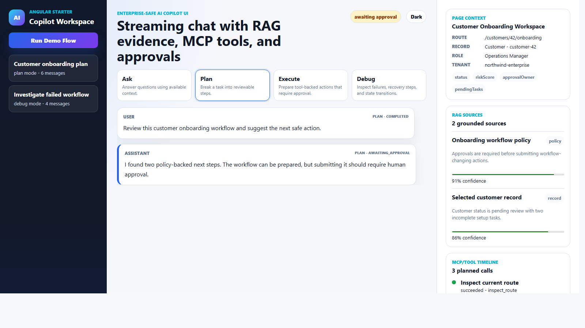
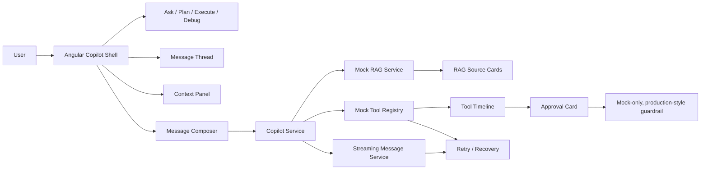

# Angular AI Copilot Starter


Build a polished, recruiter-facing Angular AI copilot demo with streaming chat UX, RAG source cards, MCP-style tool timeline, action approvals, deterministic failure/recovery scenarios, and enterprise agent modes.



**[Live demo](https://ankitparekh007.github.io/angular-ai-copilot-starter/)** · **[Public proof](docs/public-proof.md)** · **[Recruiter review](RECRUITER_REVIEW_GUIDE.md)** · **[Architecture](docs/architecture.md)**

**Demo boundary:** this repo is mock-only but production-style. No API keys, no backend claims, no hidden services.

## Review This Repo In 30 Seconds

- Open the **live demo** and run the deterministic flow.
- Confirm the UI exposes streaming, grounded evidence, tool planning, approval, execution state, failure, and recovery instead of collapsing everything into a chat bubble.
- Use [Public Proof](docs/public-proof.md) for a 30-second / 3-minute / 15-minute review path.

<p align="center">
  
</p>

<p align="center"><em>Real exact-branch capture: default workspace → happy-path flow → retrieval failure → rejected approval → stalled stream → retry with prior context. Mock-only and deterministic; no backend or provider execution is claimed.</em></p>

The intended UX lifecycle is:

`context → streaming → retrieval → citations → tool plan → approval → execution → result → retry/recovery`

## Why this repo matters

Most Angular AI demos stop at a chat box. This repo shows the rest of the product workflow:

- visible context
- streaming response states
- grounded RAG evidence
- tool planning and execution visibility
- human approval before risky actions
- mode-specific behavior for Ask, Plan, Execute, and Debug
- deterministic failure/recovery behavior for stalled streams, retrieval failures, failed tools, and rejected approvals

## Resilience Showcase

A successful AI demo is not enough. The starter now includes deterministic degraded states so reviewers can see what happens when dependencies or decisions fail.

The showcase covers:

- stalled stream
- retrieval failure with no fabricated citations
- failed tool remaining failed in the timeline
- rejected approval remaining non-executed
- explicit retry/recovery
- safe prior context remaining understandable after retry
- accessible status announcements for state changes

These scenarios require no provider credentials and do not perform real tool execution.

## 20-second GIF section

README walkthrough GIF:

1. Start in Ask mode.
2. Switch to Plan mode.
3. Run the demo flow.
4. Show streaming response in the message thread.
5. Highlight RAG source cards.
6. Highlight the tool timeline.
7. Pause on the approval card.
8. Trigger one failure/recovery state.
9. Toggle dark mode.

`docs/assets/screenshots/demo-walkthrough.gif`

See [docs/public-proof.md](docs/public-proof.md) for the recommended capture sequence.

## What this proves

This project demonstrates:

- Angular-first AI frontend architecture
- typed UI boundaries for copilot systems
- streaming UX without pretending a real model backend exists
- grounded answer presentation with source cards
- MCP-style tool planning and execution visibility
- human approval UX before risky actions
- deterministic failure, rejection, retry, and recovery states
- responsive, theme-aware enterprise copilot layout
- honest mock-only boundaries suitable for recruiter review

## Demo walkthrough

1. Run `npm install`
2. Run `npm start`
3. Open the local Angular URL
4. Switch between Ask, Plan, Execute, and Debug
5. Click **Run Demo Flow**
6. Watch the assistant response stream into the thread
7. Inspect the RAG source cards
8. Inspect the tool timeline
9. Approve or reject the mock workflow action
10. Trigger a deterministic degraded scenario and inspect retry/recovery behavior
11. Discuss how the mock services would map to a real backend contract

## Architecture diagram


```mermaid
flowchart LR
    User[User] --> Shell[Angular Copilot Shell]
    Shell --> Modes[Ask / Plan / Execute / Debug]
    Shell --> Thread[Message Thread]
    Shell --> Context[Context Panel]
    Shell --> Composer[Message Composer]
    Composer --> Service[Copilot Service]
    Service --> Streaming[Streaming Message Service]
    Service --> Rag[Mock RAG Service]
    Service --> Tools[Mock Tool Registry]
    Rag --> Sources[RAG Source Cards]
    Tools --> Timeline[Tool Timeline]
    Timeline --> Approval[Approval Card]
    Approval --> Guardrail[Mock-only, production-style guardrail]
    Streaming --> Recovery[Retry / Recovery]
    Tools --> Recovery
```

## Recruiter review in 3 minutes

### Minute 1

- scan the hero screenshot
- read the one-line pitch
- read **What this proves**

### Minute 2

- inspect the Ask / Plan / Execute states
- inspect one resilience state
- review the architecture diagram
- confirm the mock-only boundaries are explicit

### Minute 3

- inspect `src/app/copilot/models/`
- inspect `src/app/copilot/services/`
- inspect `src/app/copilot/components/`
- inspect the deterministic failure/recovery tests

More detail:

- [docs/public-proof.md](docs/public-proof.md)
- [RECRUITER_REVIEW_GUIDE.md](RECRUITER_REVIEW_GUIDE.md)
- [WHAT_THIS_PROVES.md](WHAT_THIS_PROVES.md)
- [docs/recruiter-notes.md](docs/recruiter-notes.md)

## Features

- modern three-panel Angular copilot shell
- reusable standalone components for key copilot surfaces
- mock streaming response simulation
- RAG source cards with confidence and source types
- MCP-style tool-call timeline
- human approval card for risky workflow actions
- execution status pill for thinking, retrieving, planning, awaiting approval, executing, completed, failed, and recovering
- deterministic degraded scenarios for stream, retrieval, tool, approval, and retry behavior
- agent modes: Ask, Plan, Execute, Debug
- page context panel with route, selected record, role, tenant, and visible fields
- light/dark theme toggle
- responsive layout for smaller screens
- mock-only services, no API keys required

## Screenshots

The screenshot set is organized around the states this repo is meant to prove:

| State | Path |
| --- | --- |
| Light shell | `docs/assets/screenshots/copilot-shell-light.png` |
| Dark shell | `docs/assets/screenshots/copilot-shell-dark.png` |
| Ask / streaming | `docs/assets/screenshots/streaming-message.png` |
| Plan / RAG sources | `docs/assets/screenshots/rag-source-cards.png` |
| Execute / tool timeline | `docs/assets/screenshots/tool-call-timeline.png` |
| Approval card | `docs/assets/screenshots/action-approval-flow.png` |
| Responsive mobile | `docs/assets/screenshots/responsive-mobile.png` |

See:

- [SCREENSHOT_CAPTURE_GUIDE.md](SCREENSHOT_CAPTURE_GUIDE.md)
- [SCREENSHOT_STATUS.md](SCREENSHOT_STATUS.md)
- [docs/public-proof.md](docs/public-proof.md)

## How to run

```bash
npm install
npm start
```

Build:

```bash
npm run build
```

Tests:

```bash
npm test
```

## Live demo deployment

This repo includes a GitHub Pages deployment workflow and checklist:

- [.github/workflows/deploy-pages.yml](.github/workflows/deploy-pages.yml)
- [DEPLOYMENT_GUIDE.md](DEPLOYMENT_GUIDE.md)
- [LIVE_DEMO_CHECKLIST.md](LIVE_DEMO_CHECKLIST.md)
- [LIVE_DEMO_STATUS.md](LIVE_DEMO_STATUS.md)

Target URL:

```text
https://ankitparekh007.github.io/angular-ai-copilot-starter/
```

## What is mocked vs real

Mocked:

- LLM responses
- RAG retrieval
- MCP/tool execution
- approvals
- sessions

Real:

- Angular component structure
- TypeScript models
- UI architecture
- simulated streaming UX
- deterministic failure/recovery state modeling
- reusable frontend patterns
- recruiter-facing documentation and contribution structure

No production backend is claimed. This is a mock-only but production-style frontend proof project.

## Ecosystem Path

**Learn → Pattern → Run → Platform → Govern → Operate**

[AI Tools Cheatsheets](https://github.com/AnkitParekh007/ai-tools-cheatsheets) → [Frontend AI Patterns](https://github.com/AnkitParekh007/frontend-ai-patterns) → **Angular AI Copilot Starter** → [ngx-copilot-platform](https://github.com/AnkitParekh007/ngx-copilot-platform) → [Agent Studio](https://github.com/AnkitParekh007/agent-studio) → [Org AI Force](https://github.com/AnkitParekh007/org-ai-force)

## Good first issues

- capture or refresh the 20-second GIF using the public-proof sequence
- improve theme polish
- extend keyboard navigation
- add another mock MCP tool
- improve RAG card accessibility
- expand transition-test coverage
- add another deterministic recovery scenario
- add Storybook or design-system variants

See [GOOD_FIRST_ISSUES.md](GOOD_FIRST_ISSUES.md).

## Docs

- [docs/public-proof.md](docs/public-proof.md)
- [docs/architecture.md](docs/architecture.md)
- [docs/deployment.md](docs/deployment.md)
- [docs/demo-script.md](docs/demo-script.md)
- [docs/interview-talking-points.md](docs/interview-talking-points.md)

## Contributing

Contributions are welcome around screenshots, responsive layout, accessibility, mock tools, RAG source rendering, tests, docs, failure/recovery behavior, and UI variants.

See [CONTRIBUTING.md](CONTRIBUTING.md).
