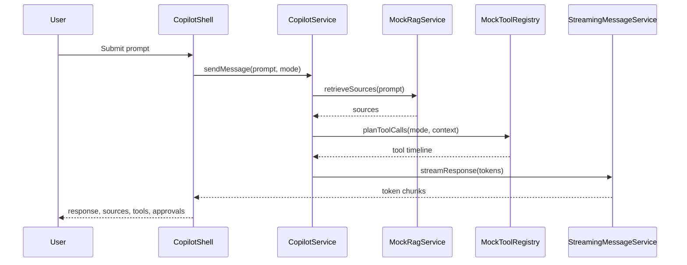

# Architecture

The copilot is modeled as a visible workflow layer inside Angular, not a standalone chatbot. The shell coordinates sessions, message streaming, RAG evidence, tool calls, and approvals through typed services.

## Design Principles

- Keep model/provider calls behind backend contracts.
- Show users what context was retrieved.
- Show tool execution as an inspectable timeline.
- Require approval for workflow-changing actions.
- Model agent state explicitly so loading, failure, recovery, and completion are visible.

## Runtime Flow

